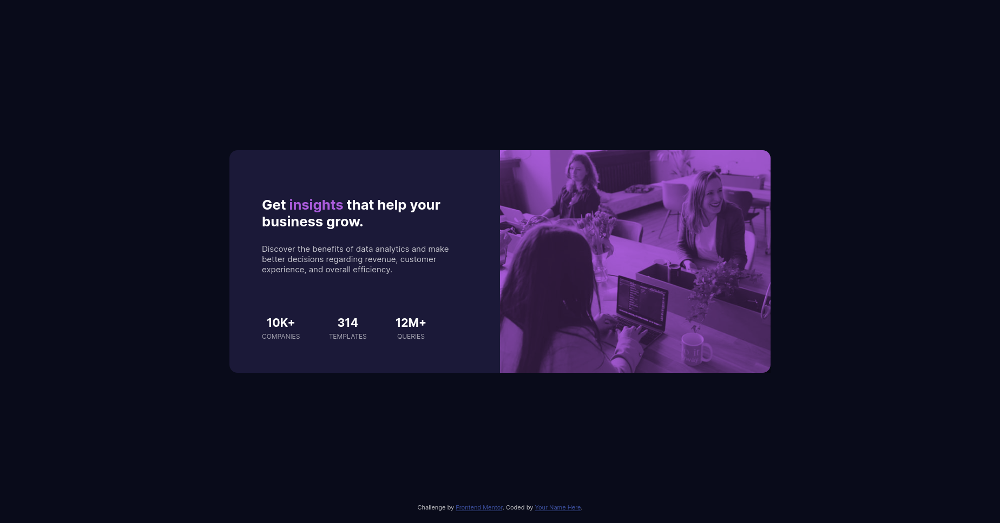

# Frontend Mentor - Stats preview card component solution

This is a solution to the [Stats preview card component challenge on Frontend Mentor](https://www.frontendmentor.io/challenges/stats-preview-card-component-8JqbgoU62). Frontend Mentor challenges help you improve your coding skills by building realistic projects. 

## Table of contents

- [Overview](#overview)
  - [The challenge](#the-challenge)
  - [Screenshot](#screenshot)
  - [Links](#links)
- [Built with](#built-with)
- [Author](#author)

## Overview

### The challenge

Users should be able to:

- View the optimal layout for the site depending on their device's screen size

### Screenshots

- Desktop:

- Mobile:

### Links

- Solution URL: https://github.com/fborlido/fm-stats preview-card-component.git
- Live Site URL: https://fborlido.github.io/fm-stats preview-card-component/

## My process

### Built with

- Semantic HTML5 markup
- Sass
- SCSS custom properties
- CSS Grid
- Mobile-first workflow

## Author

- Github - [fborlido](https://www.github.com/fborlido)
- Frontend Mentor - [@fborlido](https://www.frontendmentor.io/profile/fborlido)
